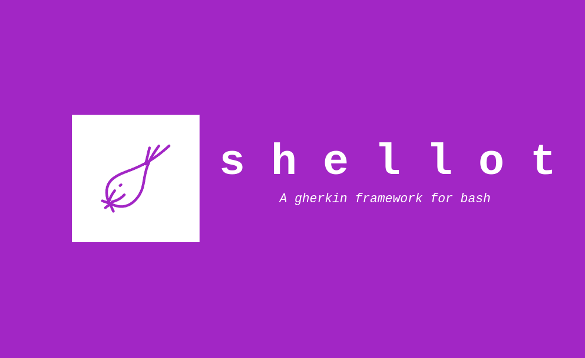

<div align="center">
  
</div>

## What is this?

_shellot_ is a simple gherkin testing framework. It's written in bash, as the tests you write for it are also just bash.

This is a work in progress so expect frequent improvements!

## How do I use it?

Run it like: `./libexec/shellot thing.feature thing-test.sh`, where `thing.feature` is a gherkin file and `thing-test.sh` is an implementing test file.

Tests are written in bash, and must return 0/1 to indicate success/failure. Tests must be registered by calling the `step` function with their associated gherkin expression as the first parameter, and the test function as the second:

```
#!/usr/bin/env bash

step "When ([0-9]+) and ([0-9]+) are added" sum_when
step "Then the result is ([0-9]+)" sum_then

function sum_when () {
  sum=$(( $1 + $2 ))
}

function sum_then () {
  if [[ $1 -eq $sum ]]; then
    return 0
  else
    return 1
  fi
}
```

Samples can be found under the `samples/` folder.